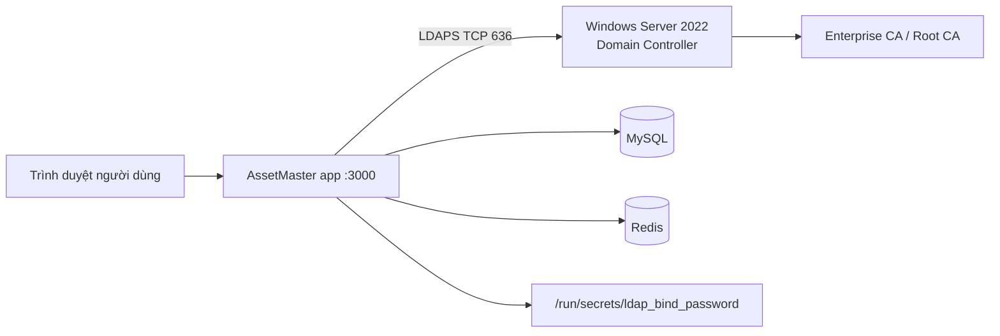

# Kết nối AssetMaster Docker Desktop với Active Directory Windows Server 2022 qua LDAPS

> **Mục đích.** Tài liệu này hướng dẫn quản trị viên kết nối bản AssetMaster chạy bằng Docker Desktop trên Windows 10/11 hoặc macOS tới **Active Directory Domain Services trên Windows Server 2022**, trong đó đăng nhập nhân viên sử dụng **LDAPS**. Quy trình giữ lại một tài khoản Admin cục bộ làm tài khoản khẩn cấp (break-glass), không lưu mật khẩu AD trong database, không đưa mật khẩu vào trình duyệt và không dùng LDAP thường trên port 389.

> **Phạm vi.** Docker Desktop phù hợp cho UAT, máy quản trị hoặc triển khai nội bộ quy mô nhỏ. Với hệ thống chạy liên tục, nên chuyển stack sang Ubuntu Server + Docker Engine + Nginx theo [runbook self-hosted chính](./huong-dan-trien-khai-noi-bo.md). Không cài Docker Desktop trên Windows Server để biến Windows Server thành máy chủ production; Windows Server 2022 trong tài liệu này là **máy Domain Controller/AD riêng**.

> **Mở nhanh trong ứng dụng.** Đăng nhập bằng Admin cục bộ, mở **Cài đặt hệ thống**, dùng biểu tượng Directory trên menu nhanh bên phải rồi nhấn **Xem hướng dẫn cấu hình** trong panel **Directory LDAP / Active Directory**. Tài liệu mở ở tab mới để có thể đối chiếu trong lúc nhập cấu hình.

## 1. Mô hình kết nối

Trong mô hình phổ biến, Docker Desktop chạy trên máy Windows client, còn Domain Controller Windows Server 2022 nằm trong cùng LAN hoặc có thể truy cập qua VPN. Container `app` kết nối trực tiếp tới FQDN của Domain Controller trên TCP 636. MySQL và Redis chỉ nằm trong mạng backend nội bộ của Compose.



| Thành phần | Ví dụ | Vai trò |
| --- | --- | --- |
| Domain Controller FQDN | `dc01.corp.example.local` | Tên phải có trong chứng chỉ LDAPS của DC |
| Domain DNS | `corp.example.local` | Hậu tố DN của Users/Groups |
| Users Base DN | `OU=Users,DC=corp,DC=example,DC=local` | Phạm vi tìm tài khoản nhân viên |
| Groups Base DN | `OU=Groups,DC=corp,DC=example,DC=local` | Phạm vi tìm nhóm quyền |
| Tài khoản bind | `CN=svc-assetmaster-ldap,OU=Service Accounts,DC=corp,DC=example,DC=local` | Tài khoản đọc Users/Groups |
| Nhóm Admin | `CN=AssetMaster-Admins,OU=Groups,DC=corp,DC=example,DC=local` | Thành viên có quyền quản trị AssetMaster |
| Nhóm User | `CN=AssetMaster-Users,OU=Groups,DC=corp,DC=example,DC=local` | Thành viên được phép đăng nhập với quyền người dùng |

## 2. Điều kiện trước khi bắt đầu

Cần chuẩn bị các thông tin sau trước khi mở Docker Desktop. Nếu không quản trị AD, hãy nhờ đội hạ tầng cung cấp các giá trị này; không tự đoán DN hoặc tên chứng chỉ.

| Thông tin cần có | Yêu cầu |
| --- | --- |
| FQDN của DC | Ví dụ `dc01.corp.example.local`; không dùng IP trong URL nếu chứng chỉ không có IP SAN |
| Port LDAPS | TCP `636`; không dùng `ldap://` hoặc port `389` cho đăng nhập |
| CA certificate PEM | Root CA và intermediate CA cần thiết để container tin cậy chứng chỉ DC |
| Bind DN | Tài khoản dịch vụ chỉ đọc, ghi đầy đủ Distinguished Name |
| Mật khẩu bind | Lưu vào file Docker secret một dòng, không gửi qua chat/email hoặc commit Git |
| Users/Groups Base DN | DN chính xác của OU hoặc container chứa người dùng và nhóm |
| Nhóm quyền | Một nhóm Admin và một nhóm User, có ít nhất một tài khoản thử nghiệm |
| DNS và firewall | Máy Docker Desktop phân giải được FQDN DC và đi được TCP 636 |

Hãy kiểm tra tên source đang dùng là bản có `docker-compose.desktop.yml`, `SELF_HOSTED_AUTH_ENABLED=true`, trang `/setup` và giao diện **Cài đặt hệ thống → Directory LDAP/AD**. Nếu source quá cũ, hãy cập nhật source trước khi cấu hình; không xóa `.assetmaster-data`, `.assetmaster-files`, `secrets` hoặc volume dữ liệu.

## 3. Chuẩn bị LDAPS trên Windows Server 2022

### 3.1. Xác định FQDN và OU của AD

Trên Domain Controller, mở PowerShell với quyền quản trị và chạy:

```
Get-ADDomain | Select-Object DNSRoot,DistinguishedName
Get-ADDomainController -Discover | Select-Object HostName,IPv4Address
```

Lấy DN thật của các OU, tài khoản dịch vụ và nhóm bằng các lệnh sau. Thay giá trị tìm kiếm theo môi trường doanh nghiệp:

```
Get-ADUser -LDAPFilter "(sAMAccountName=svc-assetmaster-ldap)" -Properties DistinguishedName |
  Select-Object Name,DistinguishedName

Get-ADGroup -Identity "AssetMaster-Admins" |
  Select-Object Name,DistinguishedName

Get-ADGroup -Identity "AssetMaster-Users" |
  Select-Object Name,DistinguishedName
```

Không sử dụng tài khoản Domain Admin làm bind account. Tài khoản dịch vụ chỉ cần quyền đọc đối tượng trong Users/Groups mà AssetMaster phải truy vấn. Nếu chính sách yêu cầu, đặt mật khẩu không hết hạn theo quy trình quản trị tài khoản dịch vụ của doanh nghiệp, bật audit và ghi nhận người sở hữu tài khoản.

### 3.2. Cấp và cài chứng chỉ cho LDAPS

Microsoft xác nhận Windows Server 2022 hỗ trợ LDAPS. Chứng chỉ của Domain Controller phải có **Server Authentication EKU** (`1.3.6.1.5.5.7.3.1`), chứa FQDN của DC trong CN hoặc SAN DNS, có private key trong Local Computer hoặc NTDS certificate store, và có chuỗi CA được client tin cậy.[1]

Nếu doanh nghiệp có Microsoft Enterprise CA, đội AD thường thực hiện như sau:

1. Trên DC, mở `certlm.msc`.

1. Vào **Personal → Certificates**, chọn **All Tasks → Request New Certificate**.

1. Chọn template phù hợp cho Domain Controller, bảo đảm tên `dc01.corp.example.local` xuất hiện trong SAN DNS.

1. Hoàn tất enrollment và kiểm tra chứng chỉ có biểu tượng private key, EKU **Server Authentication** và chain hợp lệ.

1. Nếu dùng NTDS certificate store theo chính sách của doanh nghiệp, cài certificate vào store dành cho NTDS; nếu không, Local Computer → Personal là lựa chọn thông dụng được Microsoft hỗ trợ.

Không copy private key của Domain Controller sang máy Docker. Docker Desktop chỉ cần **CA public certificate PEM**, không cần và không được nhận private key của chứng chỉ máy chủ.

Nếu CA nội bộ cấp certificate, xuất Root CA và các intermediate CA cần thiết thành PEM. Có thể xuất từ máy quản trị bằng công cụ của đội PKI; khi dán vào AssetMaster, mỗi khối phải giữ nguyên cấu trúc:

```
-----BEGIN CERTIFICATE-----
...
-----END CERTIFICATE-----
```

Nếu certificate dùng CA công khai mà Node.js trong image đã tin cậy chain, có thể để trống trường CA PEM. Với CA nội bộ, nên dán Root CA/intermediate CA vào trường **CA certificate PEM** khi kiểm tra TLS báo lỗi trust chain.

### 3.3. Mở firewall đúng phạm vi

Trên DC, chỉ mở TCP 636 từ subnet hoặc IP máy chạy Docker Desktop theo chính sách mạng. Ví dụ sau chỉ là mẫu, cần thay `10.20.30.45` bằng IP thực tế và được đội hạ tầng phê duyệt:

```
New-NetFirewallRule `
  -DisplayName "AssetMaster LDAPS from Docker Desktop" `
  -Direction Inbound `
  -Protocol TCP `
  -LocalPort 636 `
  -RemoteAddress 10.20.30.45 `
  -Action Allow
```

Không mở port 636 ra Internet. Không mở port 389 để thay thế khi LDAPS chưa hoạt động; điều đó có thể làm lộ thông tin xác thực.

### 3.4. Kiểm tra ngay trên Domain Controller bằng Ldp.exe

Microsoft khuyến nghị dùng `Ldp.exe` để kiểm tra kết nối tới port 636 và xem Event Viewer nếu lỗi.[2]

1. Trên DC, nhấn **Win + R**, nhập `ldp.exe`.

1. Chọn **Connection → Connect**.

1. Nhập FQDN DC, ví dụ `dc01.corp.example.local`, port `636`, bật **SSL**, rồi bấm **OK**.

1. Nếu kết nối TLS thành công, chọn **Connection → Bind** và bind bằng tài khoản có quyền đọc.

1. Nếu lỗi, mở **Event Viewer → Windows Logs → System**, lọc các sự kiện Schannel/LDAP; kiểm tra lại certificate, SAN, private key, CA chain và nhiều certificate trùng nhau.

## 4. Chuẩn bị Docker Desktop trên máy chạy AssetMaster

### 4.1. Cài đặt và kiểm tra Docker Desktop

Trên Windows client, Docker Desktop cần chạy **Linux containers** và WSL 2 backend. Mở PowerShell và kiểm tra:

```
wsl --update
docker version
docker compose version
```

Đặt source vào thư mục riêng, ví dụ `C:\Users\<user>\AssetMaster`. Không chạy source trực tiếp từ thư mục Downloads hoặc thư mục chia sẻ cho nhiều người.

Trong Docker Desktop, vào **Settings → Resources** và cấp tối thiểu khoảng 4 GB RAM cho UAT. Nếu Docker Desktop hiển thị yêu cầu chia sẻ thư mục, chỉ cho phép thư mục source và thư mục dữ liệu cần thiết.

### 4.2. Tạo file secret bind password

Trong thư mục source, tạo thư mục secrets nếu chưa có:

```
Set-Location "C:\Users\<user>\AssetMaster"
New-Item -ItemType Directory -Force -Path .\secrets | Out-Null
```

Tạo file `secrets\ldap_bind_password.txt` bằng password manager hoặc trình soạn thảo cục bộ. File chỉ chứa **một dòng mật khẩu**, không ghi tên tài khoản, không có dấu ngoặc kép và không commit vào Git. Thiết lập ACL để chỉ tài khoản vận hành Docker Desktop có quyền đọc/ghi:

```
icacls .\secrets\ldap_bind_password.txt /inheritance:r
icacls .\secrets\ldap_bind_password.txt /grant:r "$($env:USERNAME):R"
```

Bảo đảm `.gitignore` không theo dõi `secrets/`. Không đặt mật khẩu bind trong `.env`, trong `docker-compose.yml`, trong source frontend hoặc trong trường nhập của trình duyệt.

### 4.3. Mount secret vào service app

Compose hiện có các secret cho MySQL, Redis, JWT và setup token. Với Docker Desktop, thêm secret LDAP vào **`docker-compose.desktop.yml`** như sau:

```yaml
services:
  app:
    secrets:
      - ldap_bind_password

secrets:
  ldap_bind_password:
    file: ${ASSETMASTER_DESKTOP_SECRETS_DIR:-./secrets}/ldap_bind_password.txt
```

Giữ nguyên phần bind mount dữ liệu đã có trong file. Không thay `/run/secrets/ldap_bind_password` bằng đường dẫn Windows như `C:\...` trong giao diện AssetMaster; đường dẫn Windows chỉ xuất hiện ở phần `file:` của Compose, còn ứng dụng chỉ nhìn thấy đường dẫn Linux trong container.

Kiểm tra file Compose trước khi khởi động:

```
docker compose -f docker-compose.yml -f docker-compose.desktop.yml config --quiet
```

Nếu báo không tìm thấy secret, kiểm tra ba điểm: file có đúng tên `ldap_bind_password.txt`, `.env` có `ASSETMASTER_DESKTOP_SECRETS_DIR=./secrets`, và lệnh đang chạy từ thư mục gốc source.

### 4.4. Khởi động hoặc recreate riêng app

Nếu stack chưa chạy:

```
docker compose -f docker-compose.yml -f docker-compose.desktop.yml up -d --build
docker compose -f docker-compose.yml -f docker-compose.desktop.yml ps
```

Nếu stack đang chạy và vừa thêm hoặc đổi secret, cần recreate service `app` để Docker gắn secret mới. Lệnh này không xóa database hoặc thư mục file:

```
docker compose -f docker-compose.yml -f docker-compose.desktop.yml up -d --force-recreate app
docker compose -f docker-compose.yml -f docker-compose.desktop.yml logs --tail=100 app
```

Không dùng `docker compose down -v`. Lệnh đó có thể xóa volume dữ liệu nếu stack đang dùng volume thay vì bind mount.

### 4.5. Migration tự động trước khi app khởi động

Compose self-hosted đặt `ASSETMASTER_AUTO_MIGRATE=true` mặc định. Entrypoint sẽ nạp mật khẩu MySQL từ Docker secret, chạy các migration đã được ghi nhận trong thư mục `drizzle/`, rồi mới khởi động app. Cơ chế này xử lý các database đã có dữ liệu nhưng còn thiếu cột mới như `directoryDepartment`; migration không xóa bảng hoặc dữ liệu.

Sau khi cập nhật source, rebuild và recreate app:

```powershell
git pull
docker compose -f docker-compose.yml -f docker-compose.desktop.yml build --no-cache app
docker compose -f docker-compose.yml -f docker-compose.desktop.yml up -d --force-recreate app
docker compose -f docker-compose.yml -f docker-compose.desktop.yml logs --tail=200 app
```

Log cần có dòng `AssetMaster: database migrations are up to date.`. Nếu migration thất bại, app sẽ không khởi động để tránh chạy trên schema không tương thích; đọc lỗi SQL trong log và không xóa volume. Trường hợp database được tạo thủ công trước khi có bảng theo dõi migration, hãy backup MySQL rồi dừng lại để đội vận hành đối chiếu schema trước khi đánh dấu migration; không tự ý chạy `down -v` hoặc xóa `mysql_data`.

## 5. Kiểm tra mạng từ máy Docker Desktop và container

### 5.1. Kiểm tra DNS và TCP từ Windows host

```
Resolve-DnsName dc01.corp.example.local
Test-NetConnection dc01.corp.example.local -Port 636
```

Kết quả cần có `TcpTestSucceeded : True`. Nếu DNS không phân giải, cấu hình DNS của máy Docker Desktop phải trỏ tới DNS nội bộ có bản ghi AD; không nên chỉ thêm tạm một dòng hosts mà không có kế hoạch vận hành.

### 5.2. Kiểm tra reachability từ container app

Chạy lệnh sau để kiểm tra TCP/TLS cơ bản từ đúng network namespace của app. Lệnh dùng `rejectUnauthorized:false` **chỉ để kiểm tra đường đi và bắt tay TLS**, không phải cấu hình đăng nhập và không được dùng để bỏ qua kiểm tra CA trong AssetMaster:

```
docker compose -f docker-compose.yml -f docker-compose.desktop.yml exec -T app node -e "const tls=require('node:tls'); const host='dc01.corp.example.local'; const s=tls.connect({host,port:636,servername:host,rejectUnauthorized:false},()=>{console.log('TCP/TLS reachable');s.end()}); s.on('error',e=>{console.error(e.message);process.exit(1)})"
```

Nếu Windows host truy cập được nhưng container không truy cập được, kiểm tra VPN có cho phép lưu lượng từ Docker Desktop VM, firewall có giới hạn subnet, và DNS bên trong Docker có phân giải đúng FQDN. Nếu Docker Desktop chạy trên máy macOS, kiểm tra thêm VPN client có cho phép traffic từ VM Docker.

## 6. Hoàn tất `/setup` và giữ Admin cục bộ

Mở `http://localhost:3000/setup` trên chính máy Docker Desktop nếu `.env` đang dùng `ASSETMASTER_BIND_IP=127.0.0.1`.

1. Nhập tên website và tạo **Admin cục bộ** với mật khẩu mạnh.

1. Cấu hình MySQL bằng host `mysql`, port `3306`, database/user theo `.env`; dùng mật khẩu từ Docker secret tương ứng, không dùng MySQL root password.

1. Chạy wizard một lần để tạo bảng và tài khoản bootstrap.

1. Khi hoàn tất, đổi `ASSETMASTER_SETUP_ENABLED=false` trong `.env`.

1. Recreate service app:

```
docker compose -f docker-compose.yml -f docker-compose.desktop.yml up -d --force-recreate app
```

Giữ Admin cục bộ trong password manager. Không xóa tài khoản này sau khi bật LDAPS vì đây là đường vào khẩn cấp khi AD, DNS, certificate hoặc VPN gặp sự cố.

## 7. Nhập cấu hình LDAPS trong AssetMaster

Đăng nhập bằng Admin cục bộ, mở **Cài đặt hệ thống → Directory LDAP/AD**. Các trường trong giao diện được ánh xạ như sau:

| Trường AssetMaster | Giá trị khuyến nghị cho AD |
| --- | --- |
| **URL LDAPS** | `ldaps://dc01.corp.example.local:636` |
| **Users Base DN** | `OU=Users,DC=corp,DC=example,DC=local` |
| **Groups Base DN** | `OU=Groups,DC=corp,DC=example,DC=local` |
| **Bind DN** | DN đầy đủ của `svc-assetmaster-ldap` |
| **Tệp secret LDAP** | `/run/secrets/ldap_bind_password` |
| **CA certificate PEM** | Root/intermediate CA nội bộ; có thể để trống nếu chain công khai đã được tin cậy |
| **Login** | `userPrincipalName` nếu nhân viên đăng nhập bằng email; `sAMAccountName` nếu đăng nhập bằng username ngắn |
| **Email** | `userPrincipalName` nếu AD không điền `mail`; có thể dùng `mail` khi thuộc tính này được quản trị đầy đủ |
| **Tên hiển thị** | `displayName` |
| **ID bất biến** | `objectGUID` |
| **Phòng ban** | `department` |
| **Chức vụ** | `title` |
| **DN nhóm Admin** | DN đầy đủ của `AssetMaster-Admins` |
| **DN nhóm User** | DN đầy đủ của `AssetMaster-Users` |
| **Có nhóm lồng nhau** | Chỉ bật khi AD thực sự dùng nested groups và đội hạ tầng đã kiểm tra rule tương ứng |

Nếu muốn người dùng nhập địa chỉ email như `nguyenvana@corp.example.local`, chọn `userPrincipalName` cho trường **Login** và **Email**. Trên nhiều AD Windows Server, thuộc tính `mail` có thể để trống dù `userPrincipalName` có giá trị; AssetMaster không còn loại bỏ các tài khoản đó khi đồng bộ và sẽ dùng UPN làm email dự phòng. Nếu chọn `sAMAccountName` cho Login, người dùng phải nhập username ngắn như `nguyenvana`, không nhập email.

Thực hiện đúng thứ tự sau:

1. Nhập các trường và bấm **Lưu bản nháp Directory**.

1. Bấm **Kiểm tra bản nháp**. Kết quả phải vượt qua TLS/CA, bind và truy vấn Users Base DN.

1. Nếu kiểm tra đạt, mở **Cài đặt hệ thống → Trạng thái hạ tầng** và bấm **Kiểm tra LDAPS**. Panel này chỉ trả trạng thái an toàn, không trả bind password.

1. Mở lại Directory, tìm nhóm LDAPS và xác nhận đúng DN nhóm Admin/User.

1. Lưu mapping nhóm. Người không thuộc nhóm được ánh xạ sẽ bị từ chối đăng nhập.

1. Đồng bộ thử một số tài khoản, kiểm tra tên, email, phòng ban và chức vụ trước khi kích hoạt rộng.

Sau khi một tài khoản AD đăng nhập thành công, AssetMaster tự động cập nhật hồ sơ theo `directoryObjectId` bất biến: họ tên, email, username Directory, chức vụ, phòng ban AD và thời điểm đồng bộ. Nếu tên phòng ban khớp danh mục nội bộ sau khi chuẩn hóa Unicode/khoảng trắng, hệ thống cập nhật `departmentId`; nếu chưa khớp, vẫn lưu tên phòng ban AD để Admin xử lý mà không tự ý xóa phân công nội bộ. Tài khoản Admin hiện có không bị hạ quyền chỉ vì lần đăng nhập đó được xếp vào nhóm User.

1. Bấm **Kích hoạt LDAPS** khi tài khoản pilot đã đăng nhập thành công.

Không dán mật khẩu bind vào form. Form chỉ nhận **đường dẫn secret**; mật khẩu được đọc server-side từ file `/run/secrets/ldap_bind_password` và bị kiểm tra là file thường, không phải symlink, không cho group/other ghi.

### Kiểm tra sẵn sàng LDAPS trước khi kích hoạt

Trong panel **Directory LDAP / Active Directory**, AssetMaster hiển thị trạng thái
tệp secret ngay dưới đường dẫn:

- **Đã mount**: tệp tồn tại trong container. Thông báo đi kèm xác nhận container
  có quyền đọc hoặc cảnh báo quyền truy cập.
- **Chưa mount**: không tìm thấy tệp tại đường dẫn đã cấu hình. Kiểm tra lại tên
  secret và phần mount trong Docker Compose.
- AssetMaster không hiển thị, gửi về trình duyệt hoặc ghi log nội dung mật khẩu
  bind.

Nhấn **Chạy kiểm tra** để kiểm tra toàn diện thông số đang nhập mà không lưu:

1. Tệp secret tồn tại, là tệp thường, không phải symlink và có quyền an toàn.
2. Container phân giải được DNS của Domain Controller.
3. Container kết nối được cổng TCP 636.
4. CA certificate đúng định dạng, còn hạn hoặc kho CA hệ thống dùng được.
5. Bắt tay TLS, bind account và Users Base DN hoạt động.

Sau khi lưu cấu hình, nhấn **Kiểm tra LDAPS** ở cuối panel. Chỉ khi toàn bộ kiểm
tra thành công, nút **Kích hoạt LDAPS** mới khả dụng.

## 8. Kiểm thử đăng nhập với tài khoản pilot

Tạo hoặc chọn một tài khoản test trong AD, thêm tài khoản đó vào `AssetMaster-Users`, sau đó mở trang đăng nhập AssetMaster ở cửa sổ ẩn danh. Nhập Login theo lựa chọn ở trên và mật khẩu AD.

| Kiểm thử | Kết quả mong đợi |
| --- | --- |
| Tài khoản đúng password, thuộc nhóm User | Đăng nhập thành công với quyền người dùng |
| Tài khoản đúng password, thuộc nhóm Admin | Đăng nhập thành công với quyền quản trị |
| Tài khoản đúng password nhưng ngoài hai nhóm | Bị từ chối vì chưa thuộc nhóm được phép |
| Sai password | Thông báo `LDAP 49` ở bước user; không lộ mật khẩu |
| Tắt hoặc không mount secret | Kiểm tra LDAPS thất bại an toàn, không làm lộ secret |
| Đổi CA hoặc FQDN sai | TLS/CA kiểm tra thất bại, tài khoản local vẫn đăng nhập được |

Sau khi pilot đạt, thử logout/login lại bằng cả Admin local và tài khoản AD. Chỉ sau khi có người phụ trách khác xác nhận đường lui, mới thông báo cho toàn bộ nhân viên.

## 9. Thay đổi mật khẩu bind và cập nhật certificate

### Đổi mật khẩu bind

1. Đổi mật khẩu tài khoản dịch vụ trong AD theo quy trình của doanh nghiệp.

1. Ghi đè nội dung một dòng trong `secrets\ldap_bind_password.txt`; không đổi tên file nếu giao diện đang tham chiếu `/run/secrets/ldap_bind_password`.

1. Recreate app để Docker gắn secret mới:

```
docker compose -f docker-compose.yml -f docker-compose.desktop.yml up -d --force-recreate app
docker compose -f docker-compose.yml -f docker-compose.desktop.yml logs --tail=100 app
```

1. Đăng nhập local Admin, chạy lại **Kiểm tra LDAPS**, sau đó test tài khoản pilot.

### Gia hạn certificate LDAPS

Khi certificate DC được gia hạn, kiểm tra lại FQDN/SAN, Server Authentication EKU và chain. Nếu Root/intermediate CA không thay đổi, thường không cần sửa AssetMaster. Nếu CA thay đổi, dán CA PEM mới, lưu bản nháp, chạy lại kiểm tra LDAPS rồi mới kích hoạt. Không tắt kiểm tra chứng chỉ bằng cách dùng `rejectUnauthorized:false` trong ứng dụng.

## 10. Nếu Docker vẫn gọi `/manus-storage/empty-maintenance_83a5137a.png`

Bản source hiện tại không còn dùng đường dẫn `/manus-storage/` cho trạng thái rỗng. Minh họa được vẽ bằng SVG nội tuyến nên Docker Desktop không cần truy cập Manus storage hoặc S3. Nếu Developer Tools vẫn hiển thị request tới `empty-maintenance_83a5137a.png`, container đang chạy image hoặc bundle frontend cũ, chưa phải lỗi kết nối Active Directory.

Từ thư mục gốc source mới, chạy lần lượt:

```
git pull
docker compose -f docker-compose.yml -f docker-compose.desktop.yml build --no-cache app
docker compose -f docker-compose.yml -f docker-compose.desktop.yml up -d --force-recreate app
docker compose -f docker-compose.yml -f docker-compose.desktop.yml logs --tail=100 app
```

Không chạy `down -v`, không xóa `.assetmaster-data`, `.assetmaster-files` hoặc thư mục `secrets`. Sau khi app khởi động, tải lại trình duyệt bằng `Ctrl+F5` hoặc mở cửa sổ ẩn danh. Có thể kiểm tra bundle mới bằng cách tìm request/HTML: khi lọc danh sách không có kết quả, không còn request tới `/manus-storage/empty-maintenance_83a5137a.png`.

## 11. Xử lý lỗi thường gặp

| Triệu chứng | Nguyên nhân thường gặp | Cách xử lý |
| --- | --- | --- |
| `TcpTestSucceeded : False` | Firewall, route VPN hoặc port 636 chưa mở | Kiểm tra rule trên DC, route từ Docker Desktop và đúng IP/FQDN |
| `ENOTFOUND dc01...` | DNS Docker không thấy DNS nội bộ | Kiểm tra `Resolve-DnsName`, VPN và DNS của Docker Desktop |
| TLS certificate không hợp lệ | FQDN URL không nằm trong SAN, CA chưa trust hoặc certificate hết hạn | Dùng đúng FQDN; cập nhật CA PEM; kiểm tra certificate trên DC |
| `Tệp secret LDAP không hợp lệ` | Nhập đường dẫn Windows hoặc path ngoài allowlist | Dùng đúng `/run/secrets/ldap_bind_password` trong giao diện |
| `Tệp secret LDAP phải là tệp thường...` | File là symlink hoặc group/other có quyền ghi | Tạo lại Docker secret dạng file thường và siết ACL host |
| Bind thất bại | Bind DN sai, password sai hoặc tài khoản bị khóa | Lấy lại DistinguishedName thật, kiểm tra AD account lockout và thay secret |
| Bind đạt nhưng Users Base DN lỗi | DN OU sai hoặc bind account không đọc được OU | Lấy DN bằng `Get-ADUser`/ADUC, kiểm tra quyền đọc |
| Tìm nhóm không thấy | Groups Base DN sai hoặc filter không tới OU nhóm | Kiểm tra DN nhóm và đặt đúng Groups Base DN |
| Đăng nhập báo không thuộc nhóm | User chưa là member nhóm, nested group chưa được hỗ trợ hoặc map sai DN | Thêm pilot vào nhóm đúng, dùng DN đầy đủ, chỉ bật nested khi cần |
| Đăng nhập bằng email không tìm thấy | Đang chọn `sAMAccountName` làm Login | Chọn `userPrincipalName`, hoặc nhập username ngắn đúng với sAMAccountName |
| `LDAP 49` ở bước user | Tài khoản AD hoặc mật khẩu người dùng không đúng; tài khoản có thể bị khóa/hết hạn | Thử đăng nhập bằng `Ldp.exe`, kiểm tra trạng thái AD account và nhập đúng Login theo thuộc tính đã chọn |
| `LDAP 49` ở bước bind | Bind DN hoặc mật khẩu bind sai; secret chưa được recreate vào app | Kiểm tra DN đầy đủ, nội dung secret một dòng, rồi chạy `up -d --force-recreate app` |
| `LDAP 32` ở bước search | Users Base DN sai hoặc DN không tồn tại | Lấy lại DN thật bằng ADUC/PowerShell và kiểm tra bind account có thể đọc OU |
| `LDAP 50` | Bind account không đủ quyền đọc Users/Groups | Dùng service account chỉ đọc đúng OU; kiểm tra ACL trên Users Base DN và Groups Base DN |
| Ba bước hạ tầng đạt nhưng đăng nhập vẫn lỗi chung | Bản app/container cũ hoặc lỗi nằm ở search/user bind sau kiểm tra kết nối | Rebuild app từ source mới, xem `docker compose ... logs --tail=100 app`, sau đó thử lại tài khoản pilot |
| App không thấy secret sau khi đổi file | Container cũ chưa được recreate | Chạy `up -d --force-recreate app`, không cần xóa data |
| `/setup` mở lại sau cài đặt | `ASSETMASTER_SETUP_ENABLED` vẫn true | Đổi thành false và recreate app; không để setup public |

## 12. Tắt hoặc rollback an toàn

### Tắt LDAPS nhưng giữ hệ thống hoạt động

1. Đăng nhập bằng **Admin cục bộ**.
2. Mở **Cài đặt hệ thống → Directory LDAP/AD**.
3. Nhấn **Tắt LDAPS**.
4. Mở cửa sổ ẩn danh và xác nhận đăng nhập Directory không còn được kích hoạt.
5. Đăng nhập lại bằng Admin cục bộ để xác nhận đường truy cập khẩn cấp vẫn hoạt động.

Việc tắt LDAPS không xóa người dùng đã đồng bộ, lịch sử cấu hình hoặc liên kết `directoryObjectId`. Không xóa migration và không sửa trực tiếp database chỉ để tắt xác thực Directory.

### Quay lại cấu hình LDAPS gần nhất

1. Nếu vừa sửa form nhưng chưa lưu, nhấn **Hoàn tác nháp**.
2. Nếu đã lưu cấu hình mới, nhập lại thông số trước đó rồi nhấn **Lưu nháp**.
3. Khôi phục tệp bind secret hoặc CA certificate trước đó theo quy trình quản lý secret/chứng chỉ của doanh nghiệp.
4. Recreate riêng container app nếu tệp secret đã thay đổi.
5. Chạy lại **Kiểm tra bản nháp** và **Kiểm tra LDAPS**.
6. Chỉ nhấn **Kích hoạt LDAPS** sau khi tài khoản pilot và Admin cục bộ đều được kiểm thử.

Không chạy `docker compose down -v`, không xóa thư mục dữ liệu và không ghi mật khẩu bind vào log. Nếu sự cố nằm ở AD, DNS, VPN hoặc certificate, giữ LDAPS ở trạng thái tắt cho đến khi đội hạ tầng xử lý xong.

## 13. Checklist nghiệm thu

Trước khi bàn giao cho người dùng, Admin nên xác nhận từng mục sau:

- [ ] Domain Controller có certificate LDAPS chứa đúng FQDN trong SAN và Server Authentication EKU.

- [ ] TCP 636 chỉ được mở từ subnet/IP cần thiết, không mở ra Internet.

- [ ] Máy Docker Desktop và container app phân giải được FQDN DC.

- [ ] `docker-compose.desktop.yml` mount `ldap_bind_password` vào service `app`.

- [ ] File secret không nằm trong Git, không nằm trong `.env` và không được gửi qua chat/email.

- [ ] **Kiểm tra bản nháp** và **Kiểm tra LDAPS** đều thành công.

- [ ] Nhóm Admin/User dùng DN đầy đủ và tài khoản pilot được ánh xạ đúng.

- [ ] Tài khoản AD pilot đăng nhập/logout được; tài khoản ngoài nhóm bị từ chối.

- [ ] Admin local vẫn đăng nhập được để làm break-glass.

- [ ] Có backup MySQL, thư mục `.assetmaster-data`, `.assetmaster-files` và quy trình restore đã thử trong môi trường cô lập.

## Tài liệu tham khảo

[1]: https://learn.microsoft.com/en-us/windows-server/identity/ad-ds/configure-ldap-signing-certificates "Microsoft Learn — Configure certificates for LDAP over SSL in Active Directory Domain Services"

[2]: https://learn.microsoft.com/en-us/troubleshoot/windows-server/active-directory/ldap-over-ssl-connection-issues "Microsoft Learn — Troubleshoot LDAP over SSL connection problems"

[3]: https://docs.docker.com/desktop/setup/install/windows-install/ "Docker Docs — Install Docker Desktop on Windows"

