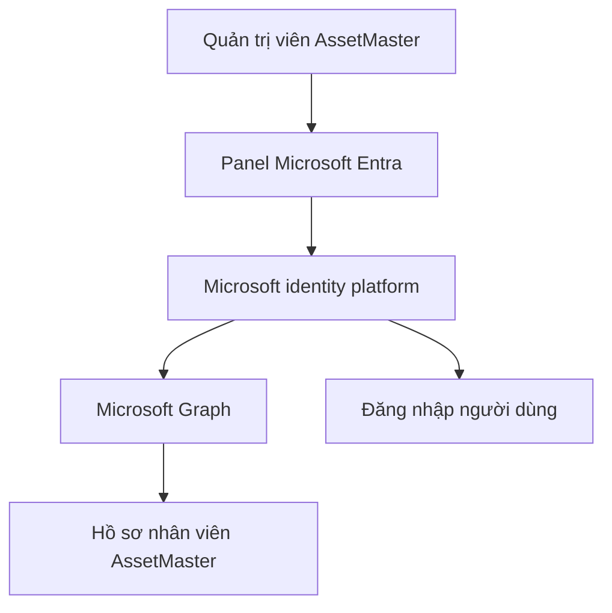

# Hướng dẫn cấu hình Microsoft Entra ID và Microsoft Graph cho AssetMaster

Tài liệu này hướng dẫn quản trị viên triển khai đăng nhập Microsoft Entra ID và đồng bộ hồ sơ nhân viên từ Microsoft Graph trên AssetMaster self-hosted.

## 1. Phạm vi chức năng

Sau khi cấu hình hoàn tất, AssetMaster hỗ trợ:

- đăng nhập bằng tài khoản Microsoft Entra ID;
- giữ đăng nhập LDAPS và Admin cục bộ làm phương thức dự phòng;
- ánh xạ App Role `AssetMaster.User` và `AssetMaster.Admin`;
- đồng bộ tên, email, phòng ban, chức danh và nhóm Entra;
- liên kết người dùng theo Entra Object ID, sau đó mới đối chiếu email;
- hiển thị nhóm Entra và thời điểm đồng bộ trong hồ sơ nhân viên.

Microsoft Graph chỉ cập nhật tài khoản AssetMaster đã tồn tại. Luồng đồng bộ không tự tạo tài khoản, không thay đổi vai trò Admin/User và không kích hoạt lại tài khoản đã khóa.

## 2. Mô hình kết nối



AssetMaster dùng hai luồng riêng:

1. **Đăng nhập người dùng:** OpenID Connect Authorization Code với PKCE.
2. **Đồng bộ hồ sơ:** OAuth 2.0 Client Credentials với scope `https://graph.microsoft.com/.default`.

## 3. Điều kiện chuẩn bị

Trước khi thực hiện, cần có:

- quyền tạo App Registration trong Microsoft Entra ID;
- quyền Grant admin consent cho Microsoft Graph;
- quyền quản trị AssetMaster bằng tài khoản Admin cục bộ;
- tên miền HTTPS dự kiến dùng cho AssetMaster production;
- Client Secret dùng cho UAT hoặc certificate/managed secret cho production;
- migration `0067_entra_identity.sql` và `0068_entra_graph_settings.sql` đã được áp dụng.

> Không tắt LDAPS hoặc tài khoản Admin cục bộ trong giai đoạn UAT.

## 4. Tạo App Registration

1. Đăng nhập [Microsoft Entra admin center](https://entra.microsoft.com/).
2. Mở **Identity → Applications → App registrations**.
3. Chọn **New registration**.
4. Nhập tên, ví dụ: `AssetMaster`.
5. Tại **Supported account types**, chọn **Accounts in this organizational directory only**.
6. Chọn **Register**.
7. Ghi lại:
   - **Directory (tenant) ID**;
   - **Application (client) ID**.

AssetMaster hiện dùng mô hình single-tenant. Không sử dụng `common`, `organizations` hoặc tenant của doanh nghiệp khác.

## 5. Khai báo Redirect URI

1. Trong App Registration, mở **Authentication**.
2. Chọn **Add a platform → Web**.
3. Thêm Redirect URI chính xác:

UAT trên máy local:

```text
http://localhost:3000/api/auth/entra/callback
```

Production:

```text
https://assetmaster.ten-cong-ty.vn/api/auth/entra/callback
```

4. Chọn **Configure** hoặc **Save**.

Giá trị trong Entra phải trùng tuyệt đối với trường **Redirect URI** trong panel AssetMaster, bao gồm giao thức, hostname, port và đường dẫn. Production bắt buộc dùng HTTPS; HTTP chỉ được chấp nhận với `localhost` hoặc `127.0.0.1`.

## 6. Tạo App Roles

Trong App Registration, mở **App roles → Create app role** và tạo hai role sau:

| Thuộc tính | Role nhân viên | Role quản trị |
| --- | --- | --- |
| Display name | AssetMaster User | AssetMaster Admin |
| Allowed member types | Users/Groups | Users/Groups |
| Value | `AssetMaster.User` | `AssetMaster.Admin` |
| Description | Truy cập portal nhân viên | Quản trị AssetMaster |
| Do you want to enable this app role? | Có | Có |

Không đổi phần **Value** nếu chưa đổi đồng thời cấu hình App Role trong AssetMaster.

## 7. Cấp quyền Microsoft Graph

1. Trong App Registration, mở **API permissions**.
2. Chọn **Add a permission**.
3. Chọn **Microsoft Graph → Application permissions**.
4. Thêm:
   - `User.Read.All`;
   - `Group.Read.All`.
5. Chọn **Grant admin consent for &lt;tên tenant&gt;**.
6. Xác nhận trạng thái của hai quyền hiển thị **Granted**.

Không chọn Delegated permissions cho tác vụ đồng bộ nền. AssetMaster dùng app-only token nên các quyền phải thuộc nhóm Application permissions.

## 8. Bắt buộc gán người dùng hoặc nhóm

1. Mở **Enterprise applications**.
2. Chọn ứng dụng AssetMaster vừa tạo.
3. Mở **Properties**.
4. Đặt **Assignment required?** thành **Yes**.
5. Mở **Users and groups → Add user/group**.
6. Gán nhóm hoặc tài khoản pilot vào một trong hai role:
   - `AssetMaster.User`;
   - `AssetMaster.Admin`.

Nên thử trước với một nhóm pilot nhỏ. Không gán toàn bộ tổ chức trong lần kiểm tra đầu tiên.

## 9. Tạo Client Secret cho UAT

1. Trong App Registration, mở **Certificates & secrets**.
2. Chọn **Client secrets → New client secret**.
3. Nhập mô tả và thời hạn phù hợp với UAT.
4. Sao chép cột **Value** ngay sau khi tạo.

> Không dùng Secret ID. AssetMaster cần giá trị ở cột Value.

### Cách nhanh cho UAT

Thêm vào file `.env` cục bộ:

```dotenv
ENTRA_CLIENT_SECRET=thay-bang-secret-uat
```

Không commit file `.env` hoặc Client Secret lên GitHub.

### Cách dùng Docker secret

Tạo file `secrets/entra_client_secret.txt` ở máy chạy Docker. Nội dung file chỉ gồm Client Secret, không thêm dấu nháy.

Tạo file override `docker-compose.entra.yml`:

```yaml
services:
  app:
    environment:
      ENTRA_CLIENT_SECRET: ""
      ENTRA_CLIENT_SECRET_FILE: /run/secrets/entra_client_secret
    secrets:
      - entra_client_secret

secrets:
  entra_client_secret:
    file: ./secrets/entra_client_secret.txt
```

Khởi động với override:

```powershell
docker compose -f docker-compose.yml -f docker-compose.desktop.yml -f docker-compose.entra.yml up -d --build --force-recreate app
```

## 10. Cấu hình trong AssetMaster

1. Đăng nhập bằng **Admin cục bộ**.
2. Mở **Cài đặt hệ thống**.
3. Nhấn icon **Cloud** trên menu nhanh bên phải.
4. Panel **Microsoft Entra ID & Graph** sẽ được mở.
5. Nhập các trường:

| Trường | Nội dung |
| --- | --- |
| Directory (Tenant) ID | Tenant ID đã ghi ở bước App Registration |
| Application (Client) ID | Client ID đã ghi ở bước App Registration |
| Redirect URI | URI Web đã khai báo trong Entra |
| Tệp Client Secret | `/run/secrets/entra_client_secret` nếu dùng Docker secret |
| App Role quản trị | `AssetMaster.Admin` |
| App Role nhân viên | `AssetMaster.User` |

6. Nhấn **Lưu nháp**.

Việc lưu thay đổi sẽ tự đưa cấu hình đang active về trạng thái tắt. Đây là cơ chế an toàn để bắt buộc kiểm tra lại trước khi kích hoạt.

## 11. Kiểm tra kết nối

Sau khi lưu nháp:

1. Nhấn **Kiểm tra kết nối**.
2. AssetMaster sẽ:
   - đọc Client Secret từ biến môi trường hoặc tệp secret;
   - yêu cầu app-only access token;
   - kiểm tra quyền đọc người dùng;
   - kiểm tra quyền đọc nhóm Microsoft Graph.
3. Chỉ khi trạng thái hiển thị thành công mới nhấn **Kích hoạt Entra ID**.

Không kích hoạt nếu kiểm tra báo lỗi. LDAPS và Admin cục bộ vẫn hoạt động độc lập.

### 11.1. Chạy preflight Nginx, TLS, DNS và Redirect URI

Trong panel **Microsoft Entra ID & Graph**, nhập Redirect URI dự kiến rồi nhấn
**Chạy preflight**. Không cần nhập hoặc hiển thị Client Secret cho bước này.

AssetMaster kiểm tra lần lượt:

1. **Entra Redirect URI**: chỉ chấp nhận HTTPS cho production, không có
   username/password, query string hoặc fragment và phải kết thúc chính xác bằng
   `/api/auth/entra/callback`. HTTP chỉ được chấp nhận với
   `localhost`/`127.0.0.1` để UAT.
2. **DNS**: phân giải hostname từ chính container ứng dụng.
3. **TLS certificate**: bắt tay TLS, kiểm tra chuỗi CA tin cậy, hostname và thời
   hạn chứng chỉ.
4. **Nginx /readyz**: gọi `<origin>/readyz` qua reverse proxy và yêu cầu HTTP
   200.

Mỗi bước hiển thị **Đạt**, **Chưa đạt** hoặc **Bỏ qua** kèm nguyên nhân. Khi sửa
Redirect URI, kết quả cũ được xóa để tránh hiểu nhầm.

> Preflight xác minh cấu trúc và khả năng truy cập từ container, nhưng không thể
> đọc cấu hình Redirect URI trong Entra Portal nếu App Registration chưa được
> cấp quyền đọc ứng dụng. Quản trị viên vẫn phải sao chép URI hiển thị và đối
> chiếu tuyệt đối trong **Authentication → Web → Redirect URIs**.

Nút **Kiểm tra kết nối** tiếp tục là cổng trước khi kích hoạt Entra: hệ thống
chạy lại preflight trên cấu hình đã lưu, sau đó mới xin app-only token và kiểm
tra quyền `User.Read.All`/`Group.Read.All`.

## 12. Đồng bộ Microsoft Graph

Sau khi Entra ID đã được kiểm tra và kích hoạt:

1. Nhấn **Đồng bộ Microsoft Graph**.
2. AssetMaster quét tối đa 500 tài khoản mỗi lượt.
3. Hệ thống đối chiếu:
   - Entra Object ID trước;
   - email đã chuẩn hóa nếu chưa có Object ID.
4. Với tài khoản khớp, hệ thống cập nhật:
   - tên hiển thị;
   - email;
   - phòng ban;
   - chức danh;
   - nhóm Entra trực tiếp và nhóm lồng nhau;
   - thời điểm đồng bộ gần nhất.
5. Mở **Quản lý nhân viên → Hồ sơ** để kiểm tra kết quả.

Nếu tên phòng ban từ Graph trùng với một phòng ban hiện có trong AssetMaster, `departmentId` sẽ được liên kết. Nếu chưa có phòng ban tương ứng, tên phòng ban Graph vẫn được lưu để quản trị viên đối chiếu.

## 13. Kiểm thử đăng nhập

Thực hiện tối thiểu các trường hợp sau:

| Trường hợp | Kết quả mong đợi |
| --- | --- |
| Người dùng có `AssetMaster.User` | Đăng nhập và mở portal nhân viên |
| Người dùng có `AssetMaster.Admin` | Đăng nhập với quyền quản trị |
| Tài khoản AD cũ có email trùng | Dùng lại hồ sơ hiện có, không tạo trùng |
| Người dùng mới không có App Role | Bị từ chối truy cập |
| Tài khoản bị khóa trong AssetMaster | Vẫn bị từ chối dù Microsoft xác thực thành công |
| Client Secret sai hoặc hết hạn | Microsoft login lỗi; LDAPS/Admin cục bộ vẫn dùng được |
| Entra ID bị tắt trong panel | Nút Microsoft và endpoint đăng nhập bị vô hiệu hóa |

## 14. Lỗi thường gặp

| Hiện tượng | Nguyên nhân thường gặp | Cách xử lý |
| --- | --- | --- |
| Tenant ID hoặc Client ID không hợp lệ | Sao chép sai UUID | Sao chép lại từ trang Overview của App Registration |
| `AADSTS50011` | Redirect URI không khớp | Đối chiếu chính xác URI trong Entra và AssetMaster |
| `invalid_client` | Secret sai, dùng Secret ID hoặc secret hết hạn | Tạo secret mới và dùng cột Value |
| `Authorization_RequestDenied` hoặc Insufficient privileges | Thiếu Graph Application permissions hoặc chưa admin consent | Kiểm tra `User.Read.All`, `Group.Read.All` và trạng thái Granted |
| Không đọc được tệp secret | File chưa mount hoặc sai đường dẫn | Kiểm tra `/run/secrets/entra_client_secret` trong container |
| Đồng bộ khớp 0 tài khoản | Email/Object ID giữa Graph và AssetMaster chưa trùng | Kiểm tra email người dùng và đăng nhập Entra pilot một lần |
| Có tên phòng ban nhưng chưa liên kết | AssetMaster chưa có phòng ban cùng tên | Tạo/đổi tên phòng ban rồi đồng bộ lại |
| Không thấy nút đăng nhập Microsoft | Entra chưa test thành công hoặc chưa kích hoạt | Mở panel Entra và kiểm tra trạng thái |

## 15. Kiểm tra container

Kiểm tra dịch vụ:

```powershell
docker compose -f docker-compose.yml -f docker-compose.desktop.yml ps
Invoke-RestMethod http://127.0.0.1:3000/readyz
```

Nếu dùng Docker secret, kiểm tra tệp đã được mount mà không in nội dung secret:

```powershell
docker compose -f docker-compose.yml -f docker-compose.desktop.yml -f docker-compose.entra.yml exec app sh -lc "test -f /run/secrets/entra_client_secret && echo SECRET_MOUNT_OK"
```

Không chạy lệnh `cat` hoặc ghi Client Secret ra log.

## 16. Tắt hoặc rollback

### Tắt Entra đã lưu trong AssetMaster

1. Đăng nhập Admin cục bộ.
2. Mở **Cài đặt hệ thống → Microsoft Entra**.
3. Nhấn **Tắt Entra ID**.

### Cấu hình cũ chỉ dùng biến môi trường

Đặt:

```dotenv
ENTRA_AUTH_ENABLED=false
```

Sau đó recreate container app. Không cần xóa migration hoặc dữ liệu `entraObjectId`; giữ dữ liệu giúp bật lại tính năng mà không tạo liên kết trùng.

## 17. Checklist trước production

- [ ] AssetMaster chạy qua HTTPS.
- [ ] Preflight Redirect URI, DNS, TLS và Nginx `/readyz` đều đạt.
- [ ] Redirect URI production đã khai báo chính xác trong Entra Portal.
- [ ] `Assignment required` đã bật.
- [ ] Người dùng/nhóm đã được gán đúng App Role.
- [ ] `User.Read.All` và `Group.Read.All` đã được admin consent.
- [ ] Client Secret không nằm trong Git, log hoặc database.
- [ ] Đã thử người dùng, Admin, tài khoản không có role và tài khoản bị khóa.
- [ ] Đã thử LDAPS và Admin cục bộ khi Entra gặp lỗi.
- [ ] Đã kiểm tra kết quả đồng bộ phòng ban, chức danh và nhóm.
- [ ] Đã có lịch xoay vòng secret và người chịu trách nhiệm.

## 18. Tài liệu Microsoft tham khảo

- [OAuth 2.0 Client Credentials flow](https://learn.microsoft.com/en-us/entra/identity-platform/v2-oauth2-client-creds-grant-flow)
- [Authorization Code flow](https://learn.microsoft.com/en-us/entra/identity-platform/v2-oauth2-auth-code-flow)
- [Microsoft Graph - List users](https://learn.microsoft.com/en-us/graph/api/user-list?view=graph-rest-1.0)
- [Microsoft Graph - Transitive group membership](https://learn.microsoft.com/en-us/graph/api/user-list-transitivememberof?view=graph-rest-1.0)
