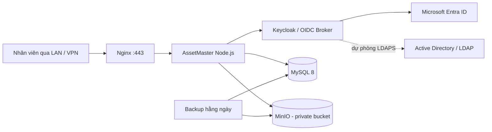

# Phương án triển khai AssetMaster nội bộ trên Ubuntu

## Khuyến nghị chốt

AssetMaster nên được vận hành **trong mạng nội bộ/VPN** trên máy chủ Ubuntu hiện có, nhưng **không tự lưu hoặc kiểm tra mật khẩu nhân viên trong ứng dụng**. Mô hình phù hợp nhất là dùng **Microsoft Entra ID làm cơ chế đăng nhập chính**, còn Active Directory/LDAP được kết nối vào một lớp quản lý danh tính để làm dự phòng hoặc phục vụ các tài khoản chưa đồng bộ lên Entra ID.

> **Nguyên tắc:** AssetMaster chỉ nhận định danh và quyền đã xác thực; mật khẩu luôn do Entra ID hoặc AD/LDAP quản lý. Điều này giữ nguyên SSO, MFA và chính sách mật khẩu hiện có của doanh nghiệp.

Microsoft Entra ID hỗ trợ OIDC để xác thực ứng dụng web bằng ID token; endpoint discovery, authorize, token và logout đều được công bố theo tenant.[1] App roles có thể gán cho người dùng hoặc nhóm và xuất hiện trong claim `roles`, phù hợp để ánh xạ quyền `admin`/`user` của AssetMaster.[2]

| Thành phần | Lựa chọn khuyến nghị | Vai trò |
|---|---|---|
| Đăng nhập chính | **Microsoft Entra ID qua OIDC** | SSO, MFA, Conditional Access, vòng đời tài khoản tập trung |
| Dự phòng/đồng bộ danh tính | **Keycloak kết nối AD/LDAP qua LDAPS** | Chỉ dùng khi cần xác thực người chưa có Entra ID hoặc cần dự phòng cục bộ |
| Ứng dụng | Node.js/Express + React AssetMaster | Giao diện, API tRPC và nghiệp vụ tài sản |
| Cơ sở dữ liệu | MySQL 8 | Dữ liệu nghiệp vụ, audit, metadata tệp và mapping quyền |
| Lưu tệp | MinIO chạy nội bộ | Lưu hợp đồng, hóa đơn, tài liệu License, PDF và ảnh scan |
| Reverse proxy | Nginx | HTTPS, reverse proxy, giới hạn tải lên, header bảo mật |
| Sao lưu | Restic hoặc Borg + kho sao lưu tách biệt | Backup MySQL, MinIO và cấu hình hằng ngày |

## Kiến trúc mục tiêu



Người dùng truy cập ví dụ `https://assetmaster.noibo.company.vn` qua VPN. Nginx là dịch vụ duy nhất mở cổng cho người dùng; MySQL, MinIO và giao diện quản trị Keycloak chỉ nằm trong Docker network nội bộ hoặc chỉ cho phép từ máy quản trị. Ứng dụng tạo session cookie an toàn sau khi xác minh OIDC và tiếp tục dùng cùng domain với API để không cần mở CORS công khai.

### Vì sao nên có Keycloak khi đã có Entra ID?

Có hai lựa chọn hợp lệ. Nếu toàn bộ nhân sự đã có Entra ID và không cần đăng nhập trực tiếp AD/LDAP, AssetMaster có thể kết nối **thẳng Entra OIDC**. Nếu doanh nghiệp muốn đúng yêu cầu “có cả hai”, Keycloak là lớp broker hợp lý: AssetMaster chỉ cần tích hợp một OIDC issuer nội bộ; Keycloak ưu tiên Entra ID, và chỉ chuyển sang LDAP/AD nếu được cấu hình. Nhờ vậy, sau này thay đổi IdP không buộc sửa lại toàn bộ ứng dụng.

| Phương án | Phù hợp khi | Điểm cần lưu ý |
|---|---|---|
| Trực tiếp Entra ID | 100% nhân sự dùng Entra, ưu tiên ít dịch vụ | Cần tự làm phương án LDAP fallback trong AssetMaster nếu phát sinh |
| Keycloak broker + Entra + LDAP | Có song song Entra và AD/LDAP, cần linh hoạt dài hạn | Thêm một container cần vá lỗi, backup và giám sát |

Với thông tin hiện tại, nên chọn **Keycloak broker**. Không nên để AssetMaster bind LDAP và tự xử lý mật khẩu; cách này làm ứng dụng phải bảo vệ thông tin nhạy cảm, phức tạp hóa MFA và vòng đời tài khoản.

## Phạm vi migration bắt buộc cho mã nguồn hiện tại

Đây là một **migration thực sự**, không chỉ là sao chép bản build. Hiện tại context xác thực lấy user từ Manus SDK; lưu tệp dùng Forge/S3 đã cấu hình sẵn. Khi tự vận hành, cần thay hai điểm này bằng adapter nội bộ.

| Hạng mục | Việc cần thực hiện |
|---|---|
| Xác thực | Thay Manus OAuth bằng OIDC Authorization Code + PKCE; xác minh issuer, audience, chữ ký JWT, nonce và state |
| Session | Tạo cookie `HttpOnly`, `Secure`, `SameSite=Lax`; lưu session server-side hoặc JWT ký bằng secret riêng |
| User | Đổi khóa danh tính chính sang `oidc_subject`/Entra Object ID; giữ email, tên, phòng ban, chi nhánh và mapping vai trò |
| Phân quyền | Ánh xạ app role Entra/Keycloak `assetmaster.admin` và `assetmaster.user` sang role nội bộ; chỉ Admin được quản trị License, khóa và thông tin nhạy cảm |
| Database | Chuyển schema Drizzle và dữ liệu hiện có sang MySQL nội bộ; chạy migration có kiểm soát |
| Tệp | Thay helper Forge bằng MinIO S3-compatible; bucket private, cấp URL tạm thời qua API sau kiểm tra quyền |
| Liên kết cũ | Rà soát logo/tệp đang trỏ `/manus-storage/...`; tải về, nhập MinIO và cập nhật metadata URL/key |
| Vận hành | Tách cấu hình ra `.env`/Docker secrets, không đưa tenant ID, client secret, DB password hay session key vào Git |

## Phân quyền đề xuất

Trong Entra ID, tạo hai app roles: `assetmaster.admin` và `assetmaster.user`. Gán role cho **nhóm bảo mật**, không gán rải rác từng nhân viên. Khi đăng nhập, role trong token được kiểm tra ở backend trước mỗi tRPC procedure nhạy cảm. Entra phát hành app roles trong claim `roles`; Microsoft cũng khuyến nghị dùng app roles hoặc groups để thực hiện RBAC.[2]

| Nhóm/role | Quyền chính |
|---|---|
| `assetmaster.admin` | Cấu hình, nhân sự, License/key, hợp đồng, xóa dữ liệu, xuất dữ liệu nhạy cảm |
| `assetmaster.user` | Xem và thao tác nghiệp vụ được cấp quyền; không xem key/mật khẩu License |
| `assetmaster.auditor` *(nên thêm sau)* | Chỉ đọc, xem audit và xuất báo cáo; không chỉnh sửa |

## Triển khai trên một Ubuntu server

Nên dùng Docker Compose để các thành phần có version, network và chính sách restart rõ ràng. Cấu trúc đề xuất:

```text
/opt/assetmaster/
├── compose.yaml
├── .env                       # chmod 600, không commit
├── app/                       # image hoặc mã nguồn đã build
├── data/mysql/
├── data/minio/
├── data/keycloak/
├── nginx/conf.d/
└── backups/
```

Với một server duy nhất, cấu hình khởi điểm thực tế là **4 vCPU, 8 GB RAM và SSD từ 200 GB**; tăng dung lượng theo tài liệu scan/PDF và số năm lưu trữ. Nếu server nhỏ hơn, có thể dùng Entra trực tiếp để bỏ Keycloak trong giai đoạn đầu. Dù chọn phương án nào, nên dành ổ đĩa hoặc kho NAS/S3 **khác máy chủ ứng dụng** cho backup; backup nằm cùng một ổ không bảo vệ được khi server hoặc ổ đĩa hỏng.

Nginx cần làm các việc sau: kết thúc TLS, chuyển tiếp `X-Forwarded-For` và `X-Forwarded-Proto`, giới hạn upload theo chính sách, chỉ chấp nhận nguồn VPN/LAN, và không public cổng MySQL/MinIO/Keycloak admin. Nếu dùng tên miền nội bộ, thiết bị người dùng phải tin cậy chứng chỉ do CA doanh nghiệp phát hành. Entra yêu cầu redirect URI đăng ký chính xác; OIDC cũng yêu cầu kiểm tra `state`, `nonce`, chữ ký và các claim token.[1]

## Lộ trình triển khai an toàn

| Giai đoạn | Kết quả cần đạt | Điều kiện qua bước |
|---|---|---|
| 1. Khảo sát | Chốt tên miền nội bộ, DNS, CA, cấu hình server, nhóm Entra và dung lượng | Có backup hiện trạng và tài khoản quản trị tách biệt |
| 2. Staging | Docker Compose chạy trong VLAN/VPN test; Entra/LDAP đăng nhập thử | MFA, role mapping và logout hoạt động |
| 3. Migration mã | Adapter OIDC, user mapping, MinIO, MySQL self-hosted và tests | Không còn phụ thuộc runtime vào Manus OAuth/Forge |
| 4. Nhập dữ liệu | Export DB, copy/tái nhập tệp, đối soát tổng số tài sản/hóa đơn/License | Hash/tổng số và phân quyền được đối chiếu |
| 5. UAT | Admin và đại diện phòng ban kiểm thử nghiệp vụ | Ký xác nhận danh sách test case trọng yếu |
| 6. Go-live | Chuyển DNS nội bộ, mở quyền nhóm và theo dõi log | Có rollback về môi trường cũ trong 1–2 tuần đầu |

## Kiểm soát vận hành tối thiểu

Backup MySQL logical mỗi đêm, snapshot/backup MinIO mỗi đêm và kiểm thử restore tối thiểu mỗi quý. Thiết lập healthcheck cho từng container, cập nhật bảo mật Ubuntu/Docker/Keycloak theo lịch, cảnh báo khi ổ đĩa trên 75%, và tách ít nhất một tài khoản break-glass quản trị khỏi tài khoản dùng thường ngày. Chỉ tài khoản service read-only mới được phép tra LDAP qua **LDAPS**, không dùng tài khoản Domain Admin.

## Thông tin cần chốt trước khi bắt đầu build migration

1. Cấu hình thực tế của server: CPU, RAM, SSD còn trống và có NAS/kho backup riêng hay không.
2. Tên DNS nội bộ mong muốn, ví dụ `assetmaster.noibo.company.vn`, và CA doanh nghiệp có sẵn hay chưa.
3. Entra tenant admin có thể tạo App Registration, app roles và nhóm bảo mật hay không.
4. AD/LDAP có LDAPS, OU nhân sự chuẩn và service account read-only hay không.
5. Có cần cho phép người dùng không có Entra ID đăng nhập LDAP ngay từ ngày đầu hay chỉ cần Entra SSO trong giai đoạn 1.

## References

[1] [Microsoft Learn — OpenID Connect on the Microsoft identity platform](https://learn.microsoft.com/en-us/entra/identity-platform/v2-protocols-oidc)

[2] [Microsoft Learn — Add app roles to your application and receive them in the token](https://learn.microsoft.com/en-us/entra/identity-platform/howto-add-app-roles-in-apps)
