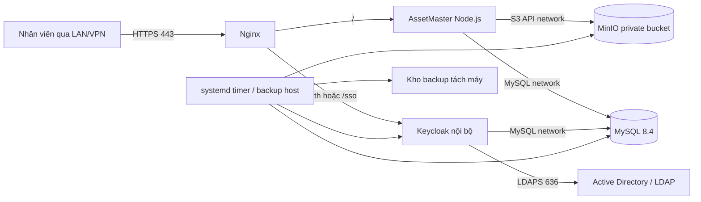

# Runbook triển khai AssetMaster nội bộ với LDAP/LDAPS duy nhất

## 1. Phạm vi và quyết định kiến trúc

AssetMaster sẽ vận hành hoàn toàn trong mạng LAN/VPN của công ty trên máy chủ Linux hiện có. **Active Directory/LDAP là nguồn duy nhất xác thực mật khẩu**. Microsoft Entra ID, Google và Manus OAuth sẽ không được sử dụng cho môi trường mới.

Ứng dụng không được nhận, ghi log, mã hóa hay lưu mật khẩu của nhân viên. Thay vào đó, người dùng đăng nhập vào **Keycloak nội bộ**; Keycloak kiểm tra thông tin đó với AD/LDAP qua **LDAPS**. AssetMaster chỉ nhận mã ủy quyền, token đã ký và các thuộc tính danh tính. Keycloak hỗ trợ kết nối LDAP/Active Directory, tạo phiên SSO và phát hành OpenID Connect (OIDC); nhờ cơ chế chuyển hướng, mật khẩu không đi qua AssetMaster.[1] [2]

> **Diễn giải “chỉ LDAP”:** LDAP/AD vẫn là nơi duy nhất quyết định tài khoản và mật khẩu hợp lệ. OIDC trong kiến trúc này chỉ là giao thức nội bộ an toàn giữa AssetMaster và Keycloak; không có nhà cung cấp danh tính bên ngoài nào được dùng.

| Thành phần | Quyết định | Phạm vi truy cập |
|---|---|---|
| Nguồn danh tính | Active Directory/LDAP qua **LDAPS** | Chỉ Keycloak truy cập Domain Controller qua TCP 636 |
| Cổng đăng nhập | Keycloak nội bộ | Chỉ HTTPS qua Nginx; không public trang quản trị |
| Ứng dụng | AssetMaster React + Express + tRPC | HTTPS qua Nginx, API dùng cùng origin |
| Dữ liệu nghiệp vụ | MySQL 8.4 LTS | Docker network riêng; không mở cổng ra LAN/VPN |
| Tệp đính kèm | MinIO private bucket | Chỉ AssetMaster truy cập API S3 nội bộ |
| Reverse proxy | Nginx | Cổng 443 là cổng ứng dụng duy nhất cho người dùng |
| Sao lưu | Restic/Borg đến NAS hoặc object storage khác máy | Chạy bằng systemd timer trên Linux |

## 2. Hai lựa chọn xác thực LDAP

| Phương án | Cách vận hành | Ưu điểm | Hạn chế | Độ phức tạp |
|---|---|---|---|---|
| **Keycloak + LDAP/LDAPS** *(khuyến nghị)* | Keycloak xác thực LDAP; AssetMaster dùng Authorization Code + PKCE | Ứng dụng không thấy mật khẩu; có SSO, logout và role mapping tập trung | Thêm một container phải cập nhật và backup | Trung bình |
| AssetMaster bind LDAP trực tiếp | Form đăng nhập trong AssetMaster gửi credential đến LDAP | Ít dịch vụ hơn | Ứng dụng phải xử lý mật khẩu, session và LDAP injection; khó nâng cấp | Cao về rủi ro |

**Chọn phương án một.** Authorization Code flow được Keycloak khuyến nghị cho ứng dụng web; Direct Grant/Resource Owner Password Credentials làm ứng dụng tiếp xúc mật khẩu và không nên sử dụng.[2] Việc chỉ dùng LDAPS là bắt buộc vì LDAP thường trên cổng 389 là không mã hóa, trong khi LDAPS tạo kết nối TLS trên cổng 636.[3] [4]

## 3. Sơ đồ kiến trúc mục tiêu



Nginx là điểm vào duy nhất cho người dùng. MySQL, MinIO và Keycloak không công khai port host. Tên truy cập đề xuất là `https://assetmaster.noibo.company.vn`; nếu dùng CA nội bộ, root CA phải được cài tin cậy trên các máy trong domain/VPN. HTTPS được áp dụng cho toàn bộ ứng dụng và cookie phiên luôn phải dùng cờ `Secure`.[6]

## 4. Luồng đăng nhập và phân quyền mới

| Bước | Xử lý | Dữ liệu được phép đi qua AssetMaster |
|---|---|---|
| 1 | Người dùng mở AssetMaster và chọn Đăng nhập | Không có mật khẩu |
| 2 | AssetMaster tạo `state`, `nonce`, PKCE verifier rồi chuyển browser sang Keycloak | URL authorization; state/nonce |
| 3 | Keycloak tìm người dùng bằng tài khoản AD và xác minh với LDAP qua LDAPS | Chỉ Keycloak nhận password |
| 4 | Keycloak trả Authorization Code về callback của AssetMaster | Code ngắn hạn + state |
| 5 | Backend đổi code lấy token, xác minh issuer, audience, chữ ký JWKS, `exp`, nonce và PKCE | Claims đã ký |
| 6 | Backend tạo session nội bộ opaque, lưu hash session trong MySQL và đặt cookie an toàn | `session_id` ngẫu nhiên, không lưu token dài hạn ở browser |
| 7 | Các tRPC protected procedure đọc session, ánh xạ quyền rồi xử lý nghiệp vụ | User ID nội bộ, role |

Khóa danh tính ổn định phải là `objectGUID` của Active Directory hoặc `entryUUID` của LDAP, **không phải email**. Email, tên, chức danh, mã nhân viên và phòng ban là thuộc tính có thể thay đổi. Bảng `users` sẽ được mở rộng bằng `identityProvider = 'ldap'`, `directoryObjectId`, `directoryUsername`, `lastDirectorySyncAt` và trạng thái hoạt động.

Phân quyền tiếp tục dùng các quyền nghiệp vụ hiện tại của AssetMaster. Cấu hình Keycloak mapper nhóm LDAP sang realm role `assetmaster.admin`, `assetmaster.user` và sau này có thể có `assetmaster.auditor`. Backend chỉ ánh xạ role đã phát hành; quyền xem key License và thao tác quản trị vẫn bắt buộc `admin`.

## 5. Chuẩn bị Active Directory/LDAP

### 5.1 Thiết lập LDAPS

Domain Controller phải có chứng chỉ LDAPS hợp lệ. Chứng chỉ cần có Server Authentication EKU, FQDN của DC trong CN hoặc SAN, private key và chuỗi CA được cả DC lẫn client tin cậy.[4] Mở TCP 636 **chỉ từ IP hoặc subnet máy chủ AssetMaster/Keycloak đến Domain Controller**. Không mở LDAP 389 cho ứng dụng.

Microsoft khuyến nghị LDAP signing và channel binding để giảm rủi ro sửa đổi, replay và man-in-the-middle. Trước khi bắt buộc chính sách trên toàn domain, đội AD cần dùng audit/event log để xác định client cũ không tương thích.[3]

### 5.2 Tài khoản dịch vụ và cấu hình LDAP

Tạo một tài khoản LDAP read-only chuyên dụng, ví dụ `svc_assetmaster_ldap`; tài khoản này **không** là Domain Admin, không có quyền reset password và chỉ được đọc các OU cần thiết. Mật khẩu tài khoản này lưu trong Docker secret hoặc file quyền `0600`, không nằm trong Git, tài liệu chia sẻ hoặc biến môi trường phía frontend.

| Tham số cần cung cấp | Ví dụ định dạng | Ghi chú |
|---|---|---|
| LDAP URL | `ldaps://dc01.corp.example:636` | Dùng FQDN có trong chứng chỉ, không dùng IP |
| Base DN | `DC=corp,DC=example` | Gốc tìm kiếm trong directory |
| Users DN | `OU=Employees,DC=corp,DC=example` | Chỉ OU nhân sự được đăng nhập |
| Bind DN | `CN=svc_assetmaster_ldap,OU=Service Accounts,...` | Tài khoản read-only |
| Username attribute | `sAMAccountName` hoặc `userPrincipalName` | Chọn một quy ước đăng nhập duy nhất |
| Stable ID | `objectGUID` hoặc `entryUUID` | Không đổi khi email đổi |
| Nhóm Admin | `CN=AssetMaster-Admins,...` | Ánh xạ role `assetmaster.admin` |
| Nhóm User | `CN=AssetMaster-Users,...` | Ánh xạ role `assetmaster.user` |
| CA chain | PEM/PKCS12 của CA doanh nghiệp | Gắn vào Keycloak truststore |

Trong Keycloak, chọn vendor **Active Directory** nếu nguồn là AD; đặt `Edit Mode = READ_ONLY`; tắt self-registration, quên mật khẩu và cập nhật mật khẩu trong Keycloak. Các chức năng đó phải do Active Directory quản lý. User federation chỉ tìm kiếm trong `Users DN` đã chốt; kết quả search và DN được xử lý qua provider chuẩn, không tự nối chuỗi filter từ đầu vào người dùng. OWASP yêu cầu escape dữ liệu không tin cậy trong LDAP filter/DN và áp dụng least privilege.[5]

## 6. Triển khai máy chủ Linux

### 6.1 Cấu hình khởi điểm và cấu trúc thư mục

Với một máy chủ chạy đồng thời ứng dụng, MySQL, MinIO và Keycloak, mốc khởi điểm nên là **4 vCPU, 8 GB RAM, SSD 200 GB**; cần tăng SSD theo tốc độ phát sinh PDF, ảnh scan và thời hạn lưu giữ. Server đơn không loại bỏ nhu cầu backup off-host: NAS hoặc object storage backup phải ở máy khác.

```text
/opt/assetmaster/
├── compose.yaml
├── .env                         # 0600, không commit
├── secrets/                     # 0700, file 0600
├── nginx/conf.d/
├── keycloak/realm-import/       # realm template không chứa password
├── data/mysql/
├── data/minio/
├── backups/staging/
└── scripts/
```

Tài khoản triển khai riêng, Docker Engine/Compose plugin, cập nhật bảo mật Ubuntu và firewall phải được hoàn thành trước. UFW chỉ cho phép TCP 443 từ subnet LAN/VPN đã duyệt và SSH từ subnet quản trị; Docker network nội bộ không publish `3306`, `9000`, `9001`, `8080` hoặc console Keycloak.

### 6.2 Compose tham chiếu

Đây là cấu trúc tham chiếu, **chưa được chạy trên production** vì AssetMaster hiện còn phải được migration khỏi xác thực và file storage của nền tảng cũ.

```yaml
services:
  mysql:
    image: mysql:8.4
    restart: unless-stopped
    command: --default-authentication-plugin=caching_sha2_password
    env_file: .env
    volumes: ["./data/mysql:/var/lib/mysql"]
    networks: [backend]

  minio:
    image: minio/minio:latest
    restart: unless-stopped
    command: server /data --console-address ":9001"
    env_file: .env
    volumes: ["./data/minio:/data"]
    networks: [backend]

  keycloak:
    image: quay.io/keycloak/keycloak:26.7
    restart: unless-stopped
    command: start --proxy-headers=xforwarded --hostname=https://assetmaster.noibo.company.vn
    env_file: .env
    depends_on: [mysql]
    networks: [backend]

  assetmaster:
    image: registry.internal.example/assetmaster:${APP_VERSION}
    restart: unless-stopped
    env_file: .env
    depends_on: [mysql, minio, keycloak]
    networks: [backend]

  nginx:
    image: nginx:1.27-alpine
    restart: unless-stopped
    ports: ["443:443"]
    volumes: ["./nginx/conf.d:/etc/nginx/conf.d:ro", "./certs:/etc/nginx/certs:ro"]
    depends_on: [assetmaster, keycloak]
    networks: [backend]

networks:
  backend:
    internal: true
```

Trong cấu hình Nginx, `/` được proxy đến AssetMaster, còn `/sso/` được proxy đến Keycloak. Nginx phải chuyển `Host`, `X-Forwarded-Proto`, `X-Forwarded-For` và `X-Real-IP`, giới hạn tải lên theo quy định công ty và đặt header chống cache cho response nhạy cảm. HTTPS chỉ dùng TLS 1.3, hoặc TLS 1.2 khi cần tương thích; TLS 1.0/1.1 bị tắt.[6]

## 7. Cấu hình Keycloak LDAP-only

1. Khởi tạo Keycloak admin bằng một tài khoản break-glass riêng; console chỉ mở từ localhost hoặc subnet quản trị.
2. Tạo realm `assetmaster`; Require SSL = `All requests`; tắt public registration, reset password và identity provider bên ngoài.
3. Tạo client confidential `assetmaster-web`; redirect URI duy nhất là `https://assetmaster.noibo.company.vn/auth/callback`; bật Authorization Code và bắt buộc PKCE S256; tắt Direct Access Grants.
4. Trong User Federation, tạo LDAP provider với URL LDAPS, CA chain, Base DN, Users DN, Bind DN và mật khẩu service account. Test connection và test authentication phải đạt trước khi tiếp tục.
5. Cấu hình mapper các thuộc tính `givenName`, `sn`, `mail`, `employeeNumber`, `title`, `department` và mapper nhóm LDAP sang realm roles.
6. Thử ba trường hợp: thành viên nhóm User, thành viên nhóm Admin và tài khoản bị disable. Kết quả yêu cầu: User đăng nhập nhưng không có trang quản trị; Admin có quyền tương ứng; tài khoản disabled bị từ chối.

## 8. Thay đổi mã nguồn bắt buộc

Đây là migration mã nguồn thật sự. Hiện AssetMaster đang dùng xác thực của Manus trong `server/_core/context.ts` và storage helper Forge trong `server/storage.ts`; vì vậy **không thể chỉ tải bản build hiện tại lên Ubuntu**.

| Phần hiện tại | Thay đổi khi self-hosted | Điều kiện nghiệm thu |
|---|---|---|
| `server/_core/context.ts` và SDK xác thực | Adapter session nội bộ đọc opaque cookie, tải user local và áp dụng `protectedProcedure`/`adminProcedure` | Không gọi Manus SDK ở runtime |
| Client login/logout | Nút login mở `/auth/login`; callback OIDC xử lý ở backend; logout xóa session local rồi logout Keycloak | Không còn portal OAuth cũ |
| User schema | Thêm `directoryObjectId`, `directoryUsername`, `identityProvider`; map một lần bằng email/mã nhân viên đã đối soát | Email đổi không tạo user mới |
| Phân quyền | Lấy `assetmaster.*` roles từ token Keycloak và map sang role nội bộ | Quyền admin không suy diễn từ tên/email |
| `server/storage.ts` | Adapter MinIO S3-compatible; private bucket; URL tải ngắn hạn sau kiểm tra quyền | Không có link `/manus-storage/` ở dữ liệu mới |
| Tệp hiện hữu | Manifest tải/copy từ storage cũ sang MinIO; thay URL bằng `fileKey` nội bộ | Đối chiếu count và checksum |
| Secrets | `DATABASE_URL`, OIDC issuer/client secret, MinIO credentials, session secret trong Docker secrets/.env `0600` | Không có secret ở client/Git |

Lớp xác thực mới nên dùng library OIDC phía server, không viết thủ công JWT parser. Session ID phải ngẫu nhiên, lưu hash trong MySQL, có TTL tối đa 8 giờ, cookie `HttpOnly; Secure; SameSite=Lax; Path=/`, xoay session sau đăng nhập và xóa khi logout. Không trả email “không tồn tại” hoặc “sai mật khẩu” riêng lẻ; trả thông báo chung để giảm lộ thông tin tài khoản.

## 9. Migration dữ liệu và tệp

### 9.1 Chuẩn bị và đối soát

Tạo staging có schema MySQL độc lập và bản sao dữ liệu đã ẩn thông tin nhạy cảm khi cần. Trước migration, xuất snapshot cơ sở dữ liệu cũ, lập manifest các tệp gồm `old_url`, loại, dung lượng, SHA-256, thực thể tham chiếu và `new_file_key`. Không tự ghép user nếu email/mã nhân viên không khớp duy nhất; các trường hợp mơ hồ phải được Admin duyệt bằng bảng đối soát.

### 9.2 Thứ tự chuyển đổi

1. Build image migration branch và chạy unit/integration tests với LDAP mock, MySQL và MinIO test.
2. Khởi tạo MySQL, MinIO private bucket và Keycloak LDAP-only ở staging.
3. Chạy Drizzle migration mở rộng mapping danh tính và session; không xóa `openId` cũ trong giai đoạn đầu.
4. Nhập dữ liệu nghiệp vụ; đối chiếu số tài sản, phụ kiện, hợp đồng, hóa đơn, License, cấp phát và audit.
5. Copy tệp sang MinIO; kiểm hash, kích thước và quyền đọc trước khi cập nhật metadata.
6. Chạy UAT LDAP; đối chiếu mapping role, upload/download chứng từ, PDF/Excel và 5 quy trình nghiệp vụ quan trọng.
7. Chỉ sau khi UAT ký xác nhận mới đóng băng dữ liệu ngắn hạn, chạy delta migration và chuyển DNS nội bộ.

## 10. Sao lưu, giám sát và khôi phục

| Cách chạy | Phù hợp | Chi phí | Độ phức tạp |
|---|---|---:|---:|
| **systemd timer trên Linux** *(khuyến nghị)* | Backup MySQL/MinIO/config định kỳ, có log và trạng thái service | Không thêm nền tảng | Trung bình |
| Cron truyền thống | Môi trường nhỏ, đội vận hành quen dùng cron | Không thêm nền tảng | Thấp |
| Chạy thủ công | Chỉ dùng trước thay đổi lớn | Chi phí nhân sự cao, dễ quên | Thấp nhưng rủi ro cao |

Mỗi đêm, export logical MySQL với `--single-transaction`, sao chép dữ liệu MinIO và backup cấu hình Nginx/Compose/realm template đã mã hóa đến NAS hoặc object storage **khác server**. Giữ ít nhất 30 daily, 12 monthly backup theo chính sách lưu trữ. Kiểm thử restore MySQL, MinIO và một tài khoản LDAP trên môi trường riêng tối thiểu mỗi quý. Không coi `Keycloak Admin Console export` là backup chính; dùng backup database hoặc boot-time export theo hướng dẫn Keycloak.[1]

Theo dõi: trạng thái container, lỗi LDAP bind, tỷ lệ đăng nhập thất bại, dung lượng disk, lỗi upload MinIO, thất bại backup và tuổi chứng chỉ TLS/LDAPS. Không ghi username/password thô, token, cookie hay private key vào log.

## 11. UAT và kế hoạch rollback

| Nhóm kiểm thử | Tình huống bắt buộc | Kết quả mong đợi |
|---|---|---|
| LDAP | Tài khoản hợp lệ, sai mật khẩu, disabled, ngoài OU | Chỉ tài khoản hợp lệ trong scope vào được |
| Role | User, Admin, thành viên bị gỡ nhóm | Quyền thay đổi theo LDAP group sau token/session refresh |
| Session | Login, logout, timeout, mở lại browser | Cookie an toàn; session cũ không dùng lại được |
| File | Upload, download có quyền, download không quyền | File private; URL chỉ tạm thời |
| Nghiệp vụ | Tài sản, bàn giao, License, hóa đơn, PDF/Excel | Không mất dữ liệu hay thay đổi nghiệp vụ |
| Khôi phục | Restore database + một tệp + Keycloak config | RTO/RPO đạt yêu cầu công ty |

Giữ môi trường hiện tại chỉ đọc trong thời gian song song đã thống nhất (đề xuất 1–2 tuần). Nếu có lỗi nghiêm trọng, trả DNS nội bộ về hệ thống cũ, khóa ghi dữ liệu ở môi trường mới, lưu log và snapshot để điều tra; không chạy migration ngược tự động trên dữ liệu đang phát sinh.

## 12. Thông tin cần chốt trước khi bắt đầu lập trình migration

1. CPU, RAM, SSD trống của Ubuntu; IP/subnet, version Ubuntu và có NAS/kho backup độc lập hay không.
2. FQDN nội bộ chính, đội quản lý DNS và CA phát hành chứng chỉ cho Nginx/Keycloak.
3. Địa chỉ LDAPS/FQDN Domain Controller, CA chain, Base DN, Users DN, username attribute và stable ID attribute.
4. Tài khoản service read-only, nhóm LDAP User/Admin, chính sách tài khoản disabled và quy tắc nhân sự ngoài OU.
5. Thời gian session mong muốn, giới hạn upload, thời gian RPO/RTO và danh sách người tham gia UAT.
6. Xác nhận dùng **Keycloak + LDAP/LDAPS-only** như cổng đăng nhập nội bộ, thay vì để AssetMaster nhận mật khẩu trực tiếp.

Sau khi nhận đủ sáu nhóm thông tin này, bước tiếp theo là tạo nhánh migration/staging riêng, cấu hình secrets an toàn, xây adapter session OIDC, adapter MinIO, schema identity mapping, script nhập file và bộ test trước khi chạm môi trường production.

## References

[1] [Keycloak Server Administration Guide — User Federation](https://www.keycloak.org/docs/latest/server_admin/#_user-storage-federation)

[2] [Keycloak — Securing applications and services with OpenID Connect](https://www.keycloak.org/securing-apps/oidc-layers)

[3] [Microsoft Learn — LDAP signing for Active Directory Domain Services](https://learn.microsoft.com/en-us/windows-server/identity/ad-ds/ldap-signing)

[4] [Microsoft Learn — Configure certificates for LDAP over SSL in Active Directory Domain Services](https://learn.microsoft.com/en-us/windows-server/identity/ad-ds/configure-ldap-signing-certificates)

[5] [OWASP — LDAP Injection Prevention Cheat Sheet](https://cheatsheetseries.owasp.org/cheatsheets/LDAP_Injection_Prevention_Cheat_Sheet.html)

[6] [OWASP — Transport Layer Security Cheat Sheet](https://cheatsheetseries.owasp.org/cheatsheets/Transport_Layer_Security_Cheat_Sheet.html)
