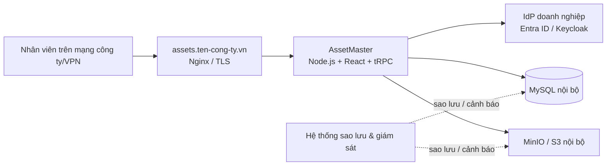

# Lộ trình đưa AssetMaster vào vận hành nội bộ

## Kết luận ngắn

**Có thể triển khai AssetMaster trong hạ tầng công ty, dùng cơ sở dữ liệu trên máy chủ nội bộ và cho nhân viên đăng nhập bằng tài khoản doanh nghiệp.** Tuy nhiên, đây là một **dự án chuyển môi trường** chứ không chỉ là đổi tên miền, bởi phiên bản hiện tại còn phụ thuộc vào xác thực Manus OAuth và dịch vụ lưu trữ tệp của Manus. Cần thay hai thành phần này bằng một nhà cung cấp đăng nhập doanh nghiệp theo chuẩn OIDC và một kho lưu trữ tệp thuộc hạ tầng công ty.

> Phương án thực tế nhất là vận hành một môi trường **staging** nội bộ trước, kiểm thử SSO và chuyển dữ liệu, sau đó mới cắt sang môi trường production. Không nên đổi trực tiếp trên hệ thống đang dùng.

## Kiến trúc đích khuyến nghị

| Lớp | Thành phần khuyến nghị | Vai trò |
|---|---|---|
| Truy cập | `https://assets.ten-cong-ty.vn` hoặc tên miền nội bộ/VPN | Điểm truy cập duy nhất cho nhân viên; chứng thư TLS do IT quản lý. |
| Reverse proxy | Nginx hoặc reverse proxy chuẩn của công ty | Kết thúc TLS, chuyển tiếp yêu cầu đến ứng dụng, giới hạn truy cập và ghi log. |
| Ứng dụng | Node.js 22, Express, React/Vite, tRPC, chạy bằng Docker Compose hoặc dịch vụ hệ điều hành | Chạy mã nguồn AssetMaster và API nghiệp vụ. |
| Đăng nhập | Microsoft Entra ID, Google Workspace, Okta hoặc Keycloak | Đăng nhập SSO bằng tài khoản doanh nghiệp qua OIDC. |
| Cơ sở dữ liệu | MySQL 8 trên máy chủ công ty | Lưu tài sản, bàn giao, bảo trì, kiểm kê, người dùng và lịch sử. |
| Lưu tệp | MinIO nội bộ tương thích S3 hoặc kho tệp được IT phê duyệt | Lưu logo, chứng từ, ảnh, PDF và tệp Excel; không lưu byte tệp trong MySQL. |
| Vận hành | Sao lưu, giám sát, log tập trung và quy trình khôi phục | Đảm bảo tính sẵn sàng, truy vết và khả năng khôi phục. |

## Những phần cần thay đổi trong mã nguồn hiện tại

| Hiện trạng | Cần chuyển đổi khi triển khai nội bộ |
|---|---|
| `server/_core/oauth.ts` dùng Manus OAuth/SDK để đăng nhập và tạo phiên | Thay bằng OIDC Authorization Code Flow với nhà cung cấp doanh nghiệp; xác thực `issuer`, `audience`, chữ ký token, `state`, `nonce` và tạo cookie phiên HTTP-only của hệ thống. |
| `server/storage.ts` dùng dịch vụ lưu trữ Forge/Manus | Viết adapter lưu trữ MinIO/S3 nội bộ hoặc adapter theo kho tệp IT chọn; chuyển các URL tệp lịch sử sang endpoint mới. |
| Các biến `BUILT_IN_FORGE_*`, `VITE_OAUTH_*`, `VITE_APP_ID` | Thay bằng biến môi trường do IT quản lý, ví dụ `DATABASE_URL`, `OIDC_ISSUER_URL`, `OIDC_CLIENT_ID`, `OIDC_CLIENT_SECRET`, `OIDC_REDIRECT_URI`, `SESSION_SECRET`, thông số S3/MinIO. |
| Database Drizzle/MySQL | Có thể giữ nguyên mô hình bảng; cần chạy migration trên MySQL nội bộ và kiểm tra charset UTF-8, quyền truy cập, sao lưu. |

## Đăng nhập tài khoản domain doanh nghiệp

### Nếu công ty dùng Microsoft 365 / Microsoft Entra ID

Đây là phương án ưu tiên khi email nhân viên đang thuộc Microsoft 365. IT tạo một **App Registration** dạng web, giới hạn tài khoản trong tenant của công ty, và khai báo redirect URI production, ví dụ `https://assets.ten-cong-ty.vn/api/auth/oidc/callback`. Microsoft Entra cung cấp discovery document, authorization endpoint, token endpoint và khóa công khai để ứng dụng xác minh token. Redirect URI phải khớp chính xác với URI đã đăng ký.[1]

Ứng dụng sẽ ánh xạ định danh ổn định của Entra (`oid`/`sub`) vào `users.openId`; email và tên chỉ là thông tin hồ sơ. Quyền **Admin/User** vẫn được quản trị trong cơ sở dữ liệu AssetMaster hoặc ánh xạ từ App Roles/Groups do IT cấp, không tin vào dữ liệu từ giao diện trình duyệt.

### Nếu công ty dùng Active Directory nội bộ

Không nên để AssetMaster xác thực trực tiếp bằng LDAP/AD. Thay vào đó, IT có thể vận hành **Keycloak** nội bộ làm lớp Identity Provider, kết nối Keycloak với AD/LDAP hoặc identity source hiện hữu; AssetMaster chỉ tích hợp OIDC với Keycloak. Keycloak công bố discovery document tại `/realms/{realm}/.well-known/openid-configuration` và hỗ trợ Authorization Code Flow cho ứng dụng web.[2]

### Quy tắc bảo mật bắt buộc cho mọi phương án

Ứng dụng phải dùng Authorization Code Flow, không dùng luồng nhập mật khẩu trực tiếp trong AssetMaster. Token trả về phải được xác minh chữ ký và các claim quan trọng trước khi tạo phiên. Microsoft cũng khuyến nghị dùng thư viện xác thực để thực hiện xác minh token thay vì tự phân tích token thủ công.[1] Mọi callback, đăng nhập và cookie production phải chạy qua HTTPS.

## Cơ sở dữ liệu trên máy chủ công ty

Máy chủ MySQL chỉ nên mở kết nối từ subnet hoặc container chạy AssetMaster; không công bố cổng MySQL ra Internet. Tạo một tài khoản riêng cho ứng dụng, chỉ có quyền trên schema AssetMaster, dùng mật khẩu dài lưu trong secret manager của công ty và bật TLS bắt buộc. MySQL nêu rõ rằng kết nối không mã hóa có thể bị quan sát trên mạng; TLS hỗ trợ mã hóa, xác thực và có thể được bắt buộc cho từng tài khoản hoặc toàn máy chủ.[3]

| Hạng mục | Yêu cầu triển khai |
|---|---|
| Database | MySQL 8.x, schema riêng ví dụ `assetmaster_prod`, timezone UTC, charset `utf8mb4`. |
| Kết nối | `DATABASE_URL` trỏ đến DNS/IP nội bộ; TLS, CA nội bộ hoặc CA công khai theo chính sách IT. |
| Quyền | User `assetmaster_app` chỉ có quyền cần thiết trên schema ứng dụng; user migration tách riêng nếu IT yêu cầu. |
| Sao lưu | Backup đầy đủ hằng ngày, log/backup tăng dần theo chính sách; kiểm thử khôi phục định kỳ trên môi trường tách biệt. |
| Tệp đính kèm | Chuyển khỏi S3 Manus sang MinIO/S3 nội bộ; lưu metadata/khóa tệp trong DB, còn nội dung file ở object storage. |

## Trình tự triển khai đề xuất

| Giai đoạn | Việc cần hoàn thành | Tiêu chí hoàn tất |
|---|---|---|
| 1. Chốt thiết kế | Chọn IdP, tên miền, nơi đặt app/DB/object storage, chính sách VPN và backup. | IT duyệt sơ đồ kiến trúc, DNS và chủ sở hữu vận hành. |
| 2. Dựng staging | Tạo môi trường `assets-stg`, MySQL staging, MinIO staging, TLS và mạng nội bộ. | Ứng dụng chạy được nhưng chưa có dữ liệu thật. |
| 3. Chuyển xác thực & storage | Thay Manus OAuth bằng OIDC doanh nghiệp; thay Forge storage bằng adapter nội bộ; quản lý secrets. | Có thể đăng nhập bằng tài khoản thử nghiệm và tải/tải xuống tệp ở staging. |
| 4. Chuyển dữ liệu | Backup nguồn, export dữ liệu và tài liệu, import sang MySQL/object storage nội bộ, kiểm tra số lượng và liên kết tệp. | Đối soát bản ghi và tệp đạt 100% theo biên bản chuyển đổi. |
| 5. UAT | Admin và nhóm nghiệp vụ kiểm thử tài sản, bàn giao, bảo trì, kiểm kê, báo cáo, upload/export, phân quyền. | Biên bản UAT và kế hoạch rollback được phê duyệt. |
| 6. Cutover | Đóng thay đổi nguồn, thực hiện delta migration, chuyển DNS/route, bật giám sát. | Người dùng đăng nhập bằng SSO công ty và vận hành trên production. |
| 7. Vận hành | Theo dõi, backup/restore drill, cập nhật bảo mật và rà soát quyền định kỳ. | Có tài liệu bàn giao cho IT và đầu mối nghiệp vụ. |

## Việc cần làm ngay

1. **Chốt Identity Provider:** công ty đang dùng Microsoft 365/Entra ID, Google Workspace, Okta, hay Active Directory nội bộ? Đây là thông tin quyết định cách viết lại xác thực.
2. **Chốt phạm vi mạng:** hệ thống chỉ dùng trong LAN/VPN hay cần truy cập Internet? IT cần cấp DNS, TLS, firewall và phân đoạn mạng tương ứng.
3. **Chuẩn bị môi trường staging:** không triển khai lần đầu trực tiếp vào production; staging phải gần giống production về SSO, MySQL và object storage.
4. **Kiểm kê dữ liệu cần chuyển:** gồm database, ảnh/logo, chứng từ, PDF và tệp đính kèm. Cần xác định yêu cầu lưu trữ và thời hạn giữ dữ liệu.
5. **Thống nhất vận hành:** đơn vị nào quản lý server, secret, chứng thư TLS, sao lưu, giám sát, xử lý sự cố và phê duyệt quyền Admin.

## Thông tin cần xác nhận trước khi bắt đầu chuyển đổi kỹ thuật

| Câu hỏi | Ví dụ trả lời |
|---|---|
| Hệ thống tài khoản doanh nghiệp đang dùng? | Microsoft 365 / Entra ID; AD DS; Google Workspace; Keycloak; khác. |
| Người dùng truy cập từ đâu? | Chỉ LAN; qua VPN; Internet công khai có MFA. |
| Hạ tầng máy chủ? | Windows Server, Ubuntu VM, VMware, Kubernetes, hoặc cloud riêng. |
| Domain dự kiến? | `assets.company.vn`, `assets.intra.company.local`, hoặc domain khác. |
| Kho tệp nội bộ? | MinIO, NAS, S3-compatible appliance, Azure Blob, khác. |
| Dữ liệu hiện hữu có cần chuyển toàn bộ? | Database, chứng từ, logo, PDF, lịch sử hoạt động; ngày cắt dự kiến. |

## References

[1] [Microsoft, *OpenID Connect on the Microsoft identity platform*](https://learn.microsoft.com/en-us/entra/identity-platform/v2-protocols-oidc)

[2] [Keycloak, *Securing applications and services with OpenID Connect*](https://www.keycloak.org/securing-apps/oidc-layers)

[3] [Oracle, *MySQL 8.4 Reference Manual — Using Encrypted Connections*](https://dev.mysql.com/doc/refman/8.4/en/encrypted-connections.html)
